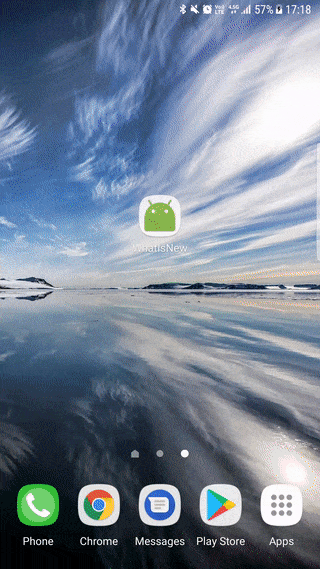

# WhatIsNewDialog
 [](https://opensource.org/licenses/Apache-2.0) [](https://android-arsenal.com/api?level=16) [](https://travis-ci.org/nonzeroapps/whatisnewdialog)
 
What is new dialog for Android is used for presenting new features in the the app. It can be used in the activity starts, from menu or from a button. It is highly customizable and flexible. It has two options (customizable) where user can either select remind me later or close. Close selection will record that dialog for given version name is seen. So next time it won't be shown to the user. It uses Glide for showing gif and images. 



## Installation

### Gradle
You can download from jitpack.

Add it as a dependency in your app's build.gradle file

${latest.version} is  1.0.4

```groovy

allprojects {
		repositories {
			...
			maven { url 'https://jitpack.io' }
		}
	}
 
 
dependencies {
   implementation 'com.github.nonzeroapps:whatisnewdialog:1.0.4'
}
```

## Features
- Add unlimited pages for dialog
- Callbacks for buttons
- It records the dialog seen condition for future openings
- Gif support.
- Parallax effects on view pager
- It can show network images, gifs or local resources (image or gif) from the project
- Extracts the accent color from your app's theme
- Customizable title, positive button and negative button texts
- Customizable button and title colors (It uses the activity style)
- Override dialog redirection to Google Play or Feedback form according to your needs
- Low memory usage

If you want the dialog to appear on the start of the app, just add the `showDialogIfConditionsSuitable(activity)` to the `onCreate()` method of your Activity class. The dialog will appear when the app is opened and the condition is satisfied.

## How to use

Use the dialog as it is

```java

NewItemDialog newItemDialog = NewItemDialog
        .init(this)
        .setVersionName("1.2.0")
        .setDialogTitle("New Features of 1.2.0 Version!")
        .setItems(arrayList);


newItemDialog.showDialog(this);

```

or for the large example 

```java

// Create and show the dialog.

ArrayList<NewFeatureItem> arrayList = new ArrayList<>();
        
NewFeatureItem newFeatureItem = new NewFeatureItem();
newFeatureItem.setFeatureDesc("From now on, you can search all things with keys. For searching please go to ");
newFeatureItem.setFeatureTitle("Searching");
newFeatureItem.setImageResource(R.drawable.androidpicture);
arrayList.add(newFeatureItem);

NewFeatureItem newFeatureItem2 = new NewFeatureItem();
newFeatureItem2.setFeatureTitle("Feature 2");
newFeatureItem2.setFeatureDesc("You waited long for this feature, we know that!!!\n\n From now on, you can follow your friend with our application. This makes our application super and cool. Don't believe my words, try and see it. If you want another features like this please contact with us via e-mail or feedback button.");
newFeatureItem2.setImageResource("https://media.giphy.com/media/JltOMwYmi0VrO/giphy.gif");
arrayList.add(newFeatureItem2);

NewItemDialog
    .init(this)
    .setVersionName("1.2.0")
    .setDialogTitle("New Features of 1.2.0 Version!")
    .setPositiveButtonTitle("Close")
    .setNeutralButtonTitle("Show Me Later")
    .setCancelable(false)
    .setItems(arrayList)
    .setCancelButtonListener(new DialogInterface.OnClickListener() {
        @Override
        public void onClick(DialogInterface dialog, int which) {
            Toast.makeText(MainActivity.this, "Close Clicked", Toast.LENGTH_LONG).show();
         }
    })
    .setShowLaterButtonListener(new DialogInterface.OnClickListener() {
         @Override
         public void onClick(DialogInterface dialog, int which) {
            Toast.makeText(MainActivity.this, "Remind Me Later Clicked", Toast.LENGTH_LONG).show();
         }
    })
    .showDialog(this);

```

### Note
* Use `showDialogIfConditionsSuitable()` for showing dialog by checking the condition. Dialog will not shown if condition is not satisfied. In other words, user closes the dialog which has the same version name before.
* Use `showDialog()` for force show of the dialog without checking the condition.
* Use `isConditionsSuitable()` to check if dialog is shown or not.
* Use `clearSharedPref()` to delete condition storages.

## Sample
Have a look at the [sample](https://github.com/nonzeroapps/whatisnewdialog/tree/master/whatisnewdialog-sample).

## Support
WhatIsNewDialog supports API level 16 and up.

## Contribute

1. Fork it
2. Create your own branch (git checkout -b new-feature-branch)
3. Commit your changes (git commit -am 'Some features added')
4. Push to the your own branch (git push origin new-feature-branch)
5. Create new Pull Request

## Credits

This project was initiated by [**NonZeroApps**](https://nonzeroapps.com). You can contribute to this project by submitting issues or/and by forking this repo and sending a pull request.


Author: [Berkay Turancı](https://github.com/berkayturanci)

# License
```
Copyright (C) 2017 NonZeroApps

Licensed under the Apache License, Version 2.0 (the "License");
you may not use this file except in compliance with the License.
You may obtain a copy of the License at

http://www.apache.org/licenses/LICENSE-2.0

Unless required by applicable law or agreed to in writing, software
distributed under the License is distributed on an "AS IS" BASIS,
WITHOUT WARRANTIES OR CONDITIONS OF ANY KIND, either express or implied.
See the License for the specific language governing permissions and
limitations under the License.
```
